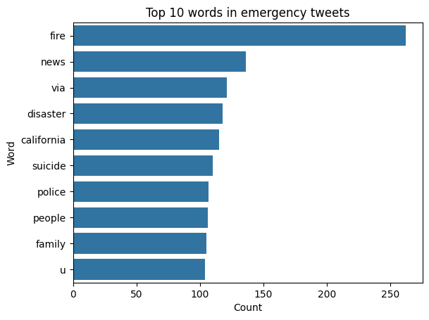
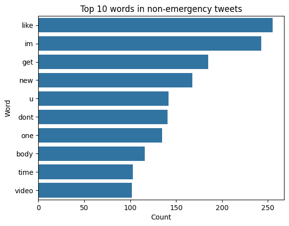

# Math 3480 Final Project Report

## Dataset

The dataset employed for this project was sourced from the [Kaggle NLP Getting Started Competition](https://www.kaggle.com/competitions/nlp-getting-started/data). The specific file utilized for the analysis was `train.csv`.

Here's a glimpse of the data:

|      |   id | keyword | location | text                                                                                                                                  | target |
| ---: | ---: | ------: | -------: | :------------------------------------------------------------------------------------------------------------------------------------ | -----: |
|    0 |    1 |     nan |      nan | Our Deeds are the Reason of this #earthquake May ALLAH Forgive us all                                                                 |      1 |
|    1 |    4 |     nan |      nan | Forest fire near La Ronge Sask. Canada                                                                                                |      1 |
|    2 |    5 |     nan |      nan | All residents asked to 'shelter in place' are being notified by officers. No other evacuation or shelter in place orders are expected |      1 |
|    3 |    6 |     nan |      nan | 13,000 people receive #wildfires evacuation orders in California                                                                      |      1 |
|    4 |    7 |     nan |      nan | Just got sent this photo from Ruby #Alaska as smoke from #wildfires pours into a school                                               |      1 |
|    5 |    8 |     nan |      nan | #RockyFire Update => California Hwy. 20 closed in both directions due to Lake County fire - #CAfire #wildfires                        |      1 |
|    6 |   10 |     nan |      nan | #flood #disaster Heavy rain causes flash flooding of streets in Manitou, Colorado Springs areas                                       |      1 |
|    7 |   13 |     nan |      nan | I'm on top of the hill and I can see a fire in the woods...                                                                           |      1 |
|    8 |   14 |     nan |      nan | There's an emergency evacuation happening now in the building across the street                                                       |      1 |
|    9 |   15 |     nan |      nan | I'm afraid that the tornado is coming to our area...                                                                                  |      1 |

Each observation in this dataset is characterized by the following variables:

- `id` - A unique identifier for each tweet.
- `text` - The actual text of the tweet.
- `location` - The geographical location from where the tweet was sent (this field may be blank).
- `keyword` - A specific keyword from the tweet (this field may also be blank).
- `target` - This field is exclusive to `train.csv` and indicates whether a tweet pertains to a real disaster (1) or not (0).

### Challenges and Resolutions

The dataset presented a few challenges, primarily due to missing values in the `keyword` and `location` columns. However, as discussed earlier, this was anticipated and did not pose a significant issue since these columns were not integral to my model.

A notable challenge emerged due to my initial misunderstanding of the `stopwords` package from `nltk.corpus`. I was surprised to find that many of the top ten words used in emergencies, according to my bar graph, were stopwords. I initially assumed that the English set of stopwords included both uppercase and lowercase versions of words. However, upon further investigation, I found that it only includes lowercase versions. This realization led me to a simple solution - converting all words to lowercase before processing. This experience underscored the critical role of data preprocessing in NLP tasks and the importance of understanding the tools and libraries we use.

Another observation that stood out was the frequent occurrence of "amp" in both of the graphs I created. It struck me as odd, as "amp" is not a word I commonly use or hear in everyday speech or writing. Upon investigating, I discovered that "&amp" was used to represent an ampersand in the text, which skewed the data. To resolve this, I used regex to replace "&amp" with an empty string, effectively removing it from the dataset.

### Natural Language Processing (NLP) Strategy

The NLP strategy I employed for this project was simple yet effective.

Firstly, I removed all non-alphanumeric characters and whitespace. My hypothesis was that punctuation and other symbols would not significantly contribute to determining whether a tweet is related to an emergency.

Next, I used `nltk.word_tokenize` to break down the text into individual words, also known as tokens.

After tokenization, I filtered out any stopwords. These are commonly used words (like "the", "a", "an", "in") that typically do not carry much meaningful information for the task at hand.

Initially, I intended to use both stemming and lemmatization techniques. However, upon further research, I found that it's generally more effective to use either one or the other. Given that lemmatization usually provides more accurate results by considering the context and part of speech, I decided to use it.

Consequently, I used `nltk.WordNetLemmatizer` to lemmatize the words, reducing them to their base or root form, known as the lemma.

> **Note:** An interesting observation was made when I switched to lemmatization. The word "bomb" fell out of the top ten words used in emergency tweets. Upon investigation, I found that `nltk.WordNetLemmatizer` lemmatizes "bombing" to "bombing", "bomber" to "bomber", and "bomb" to "bomb". In contrast, PorterStemmer would classify all these as just "bomb".

Finally, I reassembled the processed tokens back into sentences, preparing them for further analysis.

### Comparative Analysis of Word Usage In Emergencies vs Non-Emergencies

  

As expected, words such as 'Fire', 'News', 'Disaster', 'Suicide', and 'Police' frequently appear in emergency-related tweets. However, the top ten list also includes some unexpected terms like 'Via', 'People', 'Family', and 'u' (a shorthand for 'You'). 'Fire' is the most common word, appearing over 100 times more than any other word in the dataset. The frequencies of the rest of the top ten words range between 100 and 130 occurrences.

Interestingly, 'California' features prominently in this list. This could potentially be attributed to the frequent wildfires in the state, making 'California' a common term in emergency-related tweets. However, this is purely speculative and would require further investigation to confirm.

  

The top ten words in non-emergency tweets are not surprising, featuring common words like 'like', 'im' (I'm), 'get', 'new', 'u' (You), 'don't', 'one', 'time', and 'video'. The inclusion of 'body' was unexpected, as it's not a word I frequently use. However, these instances could be part of phrases like "everybody" and may not necessarily refer to a physical body.

A common trend observed in both graphs is the preference for using 'u' instead of 'you' on Twitter. This could be a remnant of the platform's old character limit or simply a reflection of the brevity favored in online communication.

### Model

In developing my model, I allocated 85% of the data for training and reserved 15% for cross-validation. 

I experimented with three different models: Support Vector Classifier (with both TF-IDF and Count Vectorizer), Random Forest Classifier, and a Multi-layer Perceptron Classifier.

Among these, the Support Vector Classifier using a Count Vectorizer demonstrated a slight edge over the others. This was determined by evaluating key metrics such as Precision, Recall, and F1-score:

|                   | Precision | Recall | F1-score | Support |
| ----------------- | --------- | ------ | -------- | ------- |
| Non-emergency (0) | 0.78      | 0.91   | 0.84     | 658     |
| Emergency (1)     | 0.85      | 0.66   | 0.74     | 484     |
| **Accuracy**      |           |        | 0.81     | 1142    |
| **Macro avg**     | 0.82      | 0.79   | 0.79     | 1142    |
| **Weighted avg**  | 0.81      | 0.81   | 0.80     | 1142    |

The other models also performed well, but fell slightly short in comparison:

**Support Vector Classifier (TF-IDF Vectorizer):**

|                   | Precision | Recall | F1-score | Support |
| ----------------- | --------- | ------ | -------- | ------- |
| Non-emergency (0) | 0.77      | 0.93   | 0.84     | 658     |
| Emergency (1)     | 0.87      | 0.63   | 0.73     | 484     |
| **Accuracy**      |           |        | 0.80     | 1142    |
| **Macro avg**     | 0.82      | 0.78   | 0.78     | 1142    |
| **Weighted avg**  | 0.81      | 0.80   | 0.79     | 1142    |

**Random Forest Classifier (Count Vectorizer):**

|                   | Precision | Recall | F1-score | Support |
| ----------------- | --------- | ------ | -------- | ------- |
| Non-emergency (0) | 0.77      | 0.91   | 0.83     | 658     |
| Emergency (1)     | 0.83      | 0.63   | 0.72     | 484     |
| **Accuracy**      |           |        | 0.79     | 1142    |
| **Macro avg**     | 0.80      | 0.77   | 0.77     | 1142    |
| **Weighted avg**  | 0.80      | 0.79   | 0.78     | 1142    |

**Multi-layer Perceptron Classifier (Count Vectorizer):**

|                   | Precision | Recall | F1-score | Support |
| ----------------- | --------- | ------ | -------- | ------- |
| Non-emergency (0) | 0.77      | 0.83   | 0.80     | 658     |
| Emergency (1)     | 0.74      | 0.67   | 0.70     | 484     |
| **Accuracy**      |           |        | 0.76     | 1142    |
| **Macro avg**     | 0.76      | 0.75   | 0.75     | 1142    |
| **Weighted avg**  | 0.76      | 0.76   | 0.76     | 1142    |

The Support Vector Classifier (SVC) emerged as the standout model among the three I experimented with. Let's delve into its mechanics.

In essence, an SVC is tailored for binary classification, making it an excellent tool for distinguishing between emergencies and non-emergencies. However, it operates under the assumption that the data is linearly separable. Visualizing the separability of data beyond three dimensions is challenging, and given that each unique token in our dataset represents a new dimension, it's difficult to validate this assumption. Despite this, I proceeded under the assumption of linear separability. Advanced techniques may exist to gauge the degree of linear separability in high-dimensional data.

The concept of linear separability is integral to how SVC works. For one-dimensional data, a point separates the two classes. For two dimensions, it's a line; for three, a plane; and for four or more, a hyperplane.

The term "Support Vector" in Support Vector Classifier refers to the data points nearest to the separating hyperplane. The positioning of this hyperplane is pivotal - it must be located such that the margin (distance) between the hyperplane and its nearest points from both classes is maximized. This maximization ensures that new data points close to the boundary are less likely to be misclassified. Therefore, the points lying on the margin are termed "support vectors" as they underpin the maximum margin.

In essence, classifying new data using an SVC boils down to determining which side of the boundary the new point falls on.

## Conclusion

The Support Vector Classifier (SVC) model showed promising results, but there's always room for exploration and improvement. Other models such as Logistic Regression, Multinomial Naive Bayes, and Transformers could potentially offer better performance. I did experiment with a Neural Network, but the results were not significantly superior to the SVC. The size of the dataset also posed a challenge, as larger networks took considerable time to compile, and in some instances, the results were less satisfactory. My analysis using Natural Language Processing (NLP) revealed that the word "fire" is a strong indicator of an emergency, suggesting that fires are the most common type of emergency in the dataset.

Should I delve deeper into this data, I would be intrigued to uncover why 'California' frequently appears among the top ten words associated with emergencies. I previously hypothesized that this could be due to wildfires. To validate this theory, I could filter the data to only include entries that mention 'California' and conduct a similar analysis. Identifying the top ten words associated with emergencies in this subset of data could provide valuable insights. Given the prevalence of 'fire' in the overall dataset, I would not be surprised if 'fire' or 'wildfires' turn out to be the most common emergencies in California. However, it could also be something entirely different, like earthquakes or gang violence. 

In a hypothetical scenario where I extend this research, I might gather more tweets related to California and strive to create a model that can detect emergencies in the state. I could envision deploying a bot to scan Twitter for tweets mentioning 'California' and using the model to identify potential emergencies. For such a task, a more advanced neural network could be a suitable choice.
